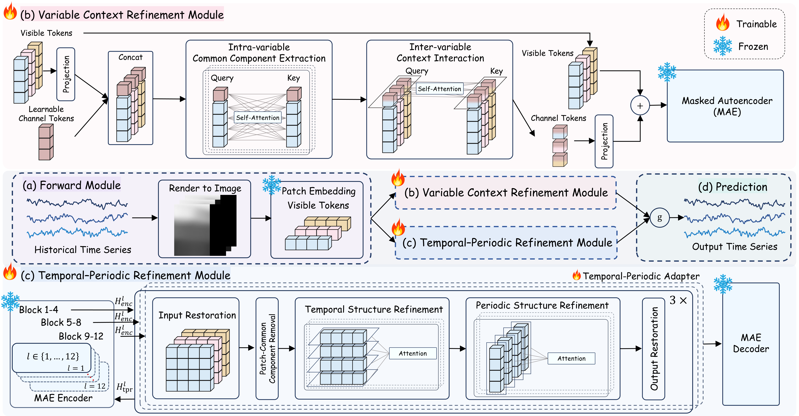
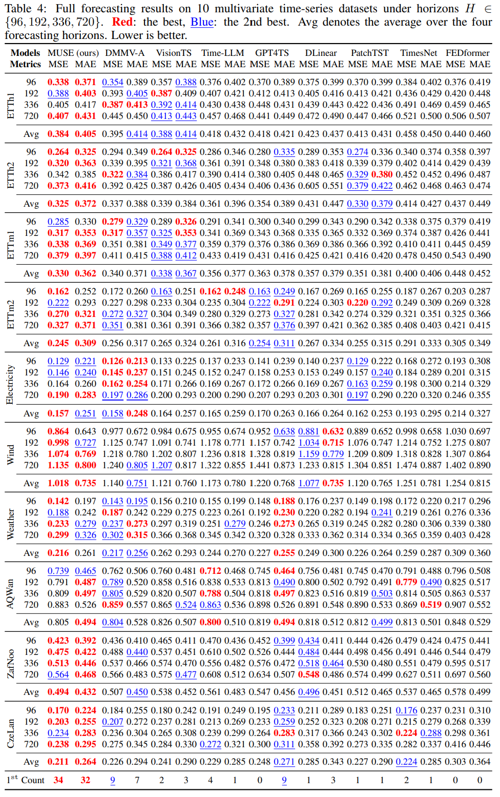

# MUSE: Dependency-Aware Adaptation of a Frozen Vision Backbone for Multivariate Time Series Forecasting

## Introduction

MUSE is a multivariate time-series forecasting framework that transfers visual representations from a frozen pretrained Masked Autoencoder (MAE) to time-series data. MUSE renders historical observations as images and introduces a trainable Variable Context Refinement Module and a Temporal-Periodic Refinement Module to model intra-variable patterns, inter-variable dependencies, temporal dynamics, and periodic structures. The forecasts produced by the two refinement branches are combined through a learnable gate.

<div align="center">

</div>

## Quickstart

> [!IMPORTANT]
> MUSE is tested with Python 3.11.15. We recommend using the same Python version for reproduction.

1. Requirements

Create and activate the Conda environment:

```shell
conda create -n muse python=3.11.15 -y
conda activate muse
```

The original experimental environment contains some dependency-version conflicts. From the project root, disable dependency resolution and install the exact versions recorded in `requirements.txt`:

```shell
python -m pip install --no-deps -r requirements.txt
```

2. Data preparation

Download the preprocessed datasets from [Google Drive](https://drive.google.com/file/d/1vgpOmAygokoUt235piWKUjfwao6KwLv7/view?usp=drive_link) or [Baidu Drive](https://pan.baidu.com/s/1ycq7ufOD2eFOjDkjr0BfSg?pwd=bpry), and extract them under `./dataset`. The CSV files should be located in `./dataset/forecasting`.

The pretrained MAE checkpoint is not included in this repository. Download the exact [`mae_visualize_vit_base.pth`](https://dl.fbaipublicfiles.com/mae/visualize/mae_visualize_vit_base.pth) checkpoint and place it at `./pretrained_weights/mae/mae_visualize_vit_base.pth`.

3. Train and evaluate model

Before running a script, replace `/home/vision` in its `checkpoint_path` with the absolute path to your project root. Keep `pretrained_weights/mae/mae_visualize_vit_base.pth` unchanged.

We provide the reproduction scripts for MUSE under `./scripts/multivariate_forecast/muse`. For example, you can reproduce the ETTh1 results with:

```shell
sh ./scripts/multivariate_forecast/muse/ETTh1.sh
```

## Results

All experiments of MUSE are conducted under the unified evaluation framework of the Time Series Forecasting Benchmark (TFB). All experiments of MUSE are implemented using PyTorch in Python 3.11.15 and executed on NVIDIA H20 GPUs. To ensure a fair comparison, we do not apply the “Drop Last” trick during validation.

<div align="center">

</div>
